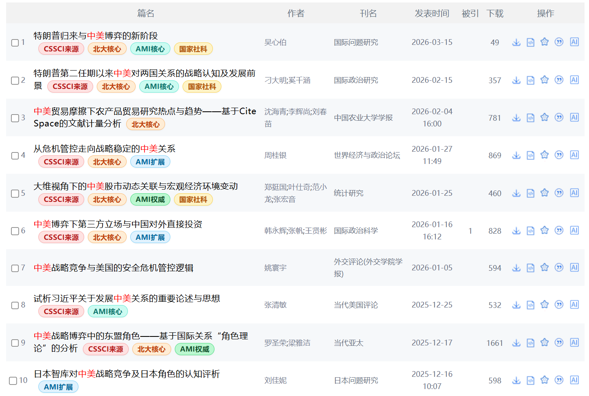
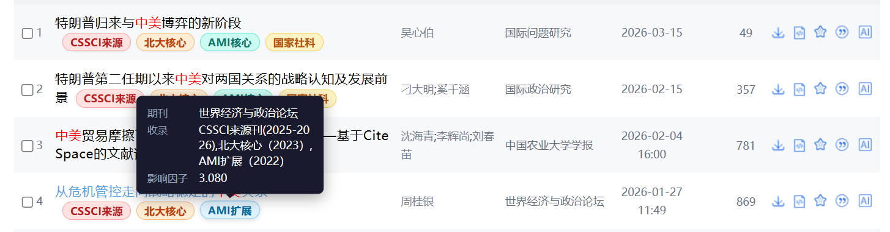
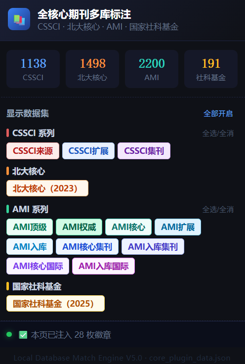

- # 📚 核心期刊多库标注扩展（人文社科专属增强版）

  
  
  
  

  一款专为人文社科领域量身打造的轻量化浏览器扩展。它能在 **中国知网 (CNKI)** 的文献检索结果页与详情页中，自动、直观地为期刊注入“C刊、北核、社科基金、AMI”等权威学术标签，帮助你在文献计量、开题调研及论文写作时，一眼看穿文献的学术权重。

  > 📅 **数据最后更新**：2026年05月23日  
  > 📋 **数据源支持**：依据**万维书刊网**最新公开信息清洗出的结构化数据。

  ---

  ## 🎯 为什么人文社科研究者需要它？

  在人文社科（HSS）领域，文献评价体系错综复杂。无论是**硕士/博士毕业标准**、**高校青年教师职称评定**，还是**国社科项目申报**，对引文和发文的期刊级别都有着极高且严苛的要求。

  本插件完美解决以下科研痛点：
  1. **告别频繁盲查**：无需在知网、万维书刊网和官方 PDF 目录之间来回切窗口核对期刊资质。
  2. **拒绝“**C刊**”变“**C扩**”**：清晰剥离 CSSCI 正刊与扩展版，避免在写文献综述时误判引文权重。
  3. **拥抱 CASS 评价新标准**：全面支持中国社会科学评价研究院的 **AMI 体系**，对社科院系统及各大高校认定的重点期刊一网打尽。
  4. **追踪国社科风向标**：独家高亮 **国家社科基金资助期刊**，紧跟学术界含金量极高的风向标。

  ---

  ## ✨ 核心特性

  - **🚀 权威多库全覆盖**：一次性精准识别并标注 **CSSCI (2025-2026)**（含来源刊/扩展版/集刊）、**北大核心 (2023)**、**AMI (2022)**（涵盖顶级/权威/核心/扩展/入库/集刊/国际刊全系列）以及 **国家社科基金 (2025)**。
  - **💅 优雅的“无感”UI**：升级为圆润的“胶囊型”徽章，色彩饱和度经调校，既显眼又不刺眼。**锁定 20px 绝对行高**，完美融入知网原生排版，绝不撑大列表行高，保持一页内的高密度阅读。
  - **🔍 智能悬浮浮层 (Tooltip)**：鼠标移过徽章时唤起暗色质感浮层，动态展示：期刊官方现用名称、完整的复合多库收录详情、该期刊最新复合影响因子。
  - **🎛️ 动态数据集筛选**：点击浏览器工具栏的插件图标即可唤起控制面板，直观查看本地数据库各库期刊总数，并支持自由开关特定数据库的显示（例如：法学/社会学同学可只勾选 C 刊和国社科，文学/历史学同学可同步开启 AMI 集刊）。
  - **🧠 强力多级匹配引擎**：针对人文社科期刊多“学报（哲社版）”、“综合性社科”等特点，内置符号全半角转换、自动补全残缺右括号、剥离末尾元信息（如“更名/合并/原名:”）等清洗算法，大幅度降低漏标率。

  ---

  ## 📸 效果预览

  |         检索结果列表页效果         |             鼠标悬浮提示              |          弹出式控制面板           |
  | :--------------------------------: | :-----------------------------------: | :-------------------------------: |
  |  |  |  |

  ---

  ## 🎓 典型科研应用场景

  ### 1. 文献检索与速读（开题/写综述）
  在面对成百上千条知网搜索结果时，优先精读 **[CSSCI 来源]** 与 **[国家社科]** 资助期刊的奠基性文献，快速理清研究脉络，避免将宝贵的文献调研时间浪费在低质量、非核心的边缘文章上。

  ### 2. 毕业论文引文自查（博硕应对盲审）
  学位论文送盲审前，使用本插件对照自己的 Reference（参考文献）列表进行排查，确保导师和盲审专家重点看重的“C刊/北核核心引文比例”达到预期标准，提升论文整体的学术卖相。

  ### 3. 拟投稿期刊摸底（避坑指南）
  人文社科期刊变动频繁（如 C 刊动态剔除、AMI 评级升降）。在准备投递稿件前，在知网搜一下该期刊，鼠标悬浮查看其最新的收录状态和影响因子，防止误投“已跌出目录”的期刊。

  ---

  ## 🛠️ 小白级安装使用指南（通过 Release 快速安装）

  本扩展基于最新的 **Chrome Extension Manifest V3 (MV3)** 标准开发，对非计算机背景的本硕博同学非常友好。无需懂任何代码，只需以下简单的 5 步即可完成本地安装：

  ### 1. 下载并解压插件包
  1. 打开本 GitHub 页面，在网页右侧找到 **`Releases`** 板块，点击最新的版本号（例如 `v1.0.0`）。
  2. 在 `Assets` 列表中，点击下载 **`CNKI-Core-Plugin.zip`** 压缩包。
  3. 下载完成后，将该压缩包解压。建议将解压后的文件夹放到一个**长期固定、不会被误删**的电脑路径下（如 `D盘/科研工具/`）。

  ### 2. 打开浏览器扩展程序管理页面
  打开你平时查文献常用的浏览器（支持 Chrome、Edge、Safari、360安全、夸克、百分浏览器等），在地址栏中输入对应的管理地址并回车：
  - **Chrome 浏览器**: `chrome://extensions/`
  - **Edge 浏览器**: `edge://extensions/`

  ### 3. 开启“开发者模式”
  在打开的扩展程序管理页面右上角，找到并打开 **“开发者模式” (Developer Mode)** 的开关。

  ### 4. 加载插件文件夹
  1. 点击左上角出现的 **“加载已解压的扩展程序” (Load unpacked)** 按钮。
  2. 在弹出的文件选择框中，选中你刚刚解压出来的**整个项目根文件夹**（点击进入该文件夹后，能直接看到 `manifest.json` 文件即可）。
  3. 此时浏览器页面上会出现带有书本金牌图标的“核心期刊多库标注”卡片，代表加载成功！

  ### 5. 固定图标到工具栏
  点击浏览器右上角的“拼图”形状扩展图标，找到本插件，点击旁边的“小图钉”将其固定在工具栏上，方便随时点击控制不同数据库的开关。

  ---

  ## 📁 文件结构说明

  - `manifest.json`：定义插件元数据、宿主权限（CNKI 域）及 MV3 资源安全策略。
  - `content.js`：核心 DOM 监听与注入脚本，利用 `MutationObserver` 动态捕捉知网翻页和异步加载。
  - `content.css`：胶囊标签、交互动画以及 Tooltip 的样式声明。
  - `popup.html` / `popup.js`：控制面板，负责与 `chrome.storage` 通信以实现数据集开启状态的记忆与过滤。
  - `data/core_plugin_data.json`：插件的本地离线数据库，包含清洗后的完整映射索引。

  ---

  ## 🤝 参与学术共建

  由于人文社科期刊存在动态调整（如集刊转正、期刊更名等），如果你在查文献时发现了**漏标、误标的期刊**，或者有更好的 **UI 视觉建议**，非常欢迎为学术生态做出贡献：
  1. 提交 [收集 Bug & 缺失期刊的 Issue](https://github.com/你的用户名/你的仓库名/issues)
  2. 欢迎懂前端的同学发起 Pull Request 进行代码或样式优化。

  ## 📄 免责声明与开源协议

  - 本项目基于 **[MIT License](LICENSE)** 协议开源，完全免费。
  - 本插件所提供的数据集仅供学术交流与辅助阅读使用，数据版权归原官方数据库所有。请勿将本项目及相关清洗数据用于任何商业获利或倒卖行为。
